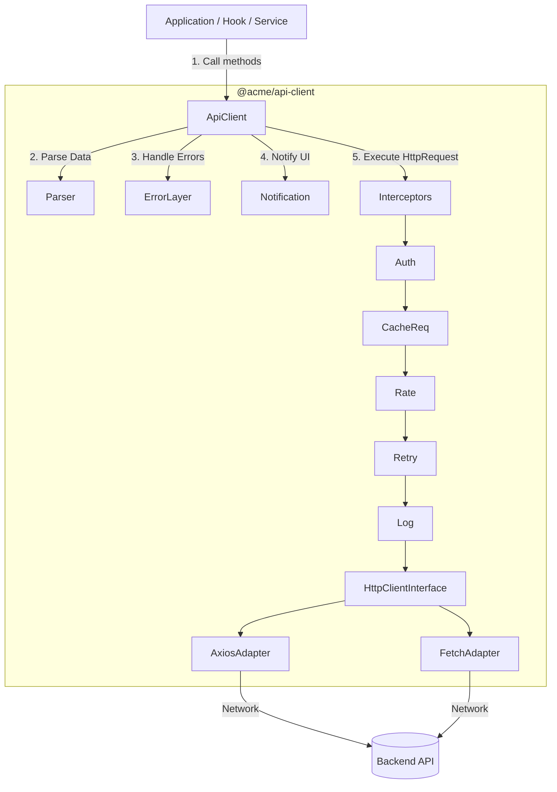
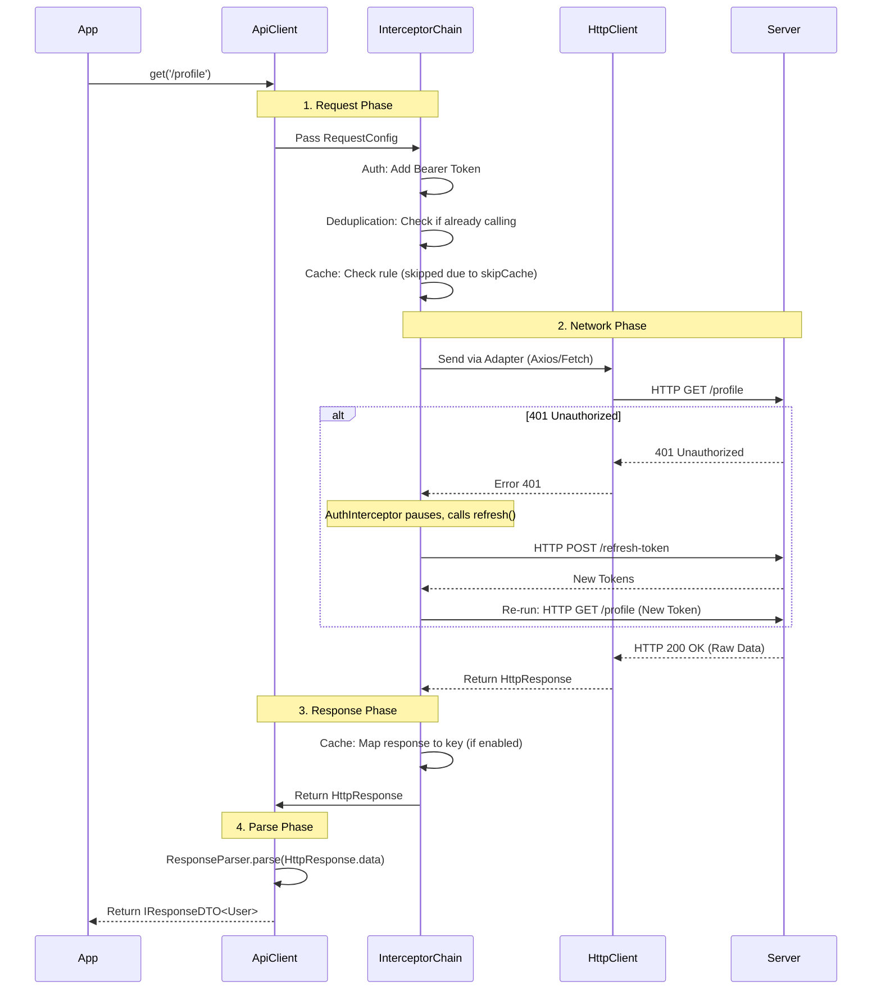

# Architecture & Workflow: @acme/api-client

Tài liệu này giải thích chi tiết về kiến trúc, luồng hoạt động (workflow), và vai trò của từng thành phần (layer) trong package `@acme/api-client`. Package này được thiết kế theo **Clean Architecture**, đảm bảo tính module hóa cao, dễ dàng mở rộng, mock/test, và không bị phụ thuộc cứng vào một thư viện HTTP request cụ thể nào.

---

## 1. Bức tranh kiến trúc tổng thể (High-level Architecture)

Packages được chia thành **7 tầng (layers)** chính, mỗi tầng chịu trách nhiệm cho một công việc duy nhất:

---

## 2. Giải thích chi tiết từng tầng (Layers Breakdown)

### 2.1. Core Types (`/core/types` & `/core/constants`)

**Vai trò:** Định nghĩa ngôn ngữ chung cho toàn bộ package.

- **Tại sao cần thiết?** Đảm bảo tất cả các tầng (Interceptos, Client, Parser) nói cùng một "ngôn ngữ" (kiểu dữ liệu). Chẳng hạn, interceptor và parser đều hiểu đối tượng `IResponseDTO` mà không cần import lẫn nhau.
- **Thành phần chính:**
  - `RequestConfig`: Cấu hình request bao gồm thông tin HTTP cơ bản và các metadata của quá trình xử lý (`_retry`, `_cacheTTL`).
  - `IResponseDTO`: Chuẩn hóa dữ liệu trả về cho App.
  - `ERROR_CODES` / `HTTP_STATUS`: Các hằng số giúp tránh việc hardcode magic strings / numbers.

### 2.2. Api Client (`api-client.ts`) - The Orchestrator

**Vai trò:** Điểm giao tiếp duy nhất (Facad e) giữa ứng dụng và hệ thống network.

- **Trách nhiệm:**
  - Cung cấp các API dễ dùng (`get`, `post`, `upload`, `download`, `withAbort`).
  - Điều phối luồng: Gửi request → Nhận `HttpResponse` → Đưa qua `ResponseParser` → Trả về `IResponseDTO` cho ứng dụng.
  - Nếu có lỗi: Bắt lỗi → Chuyển qua `IErrorHandler` → Gọi `NotificationService` → Ném `HttpException` ra ngoài.

### 2.3. Interceptors Pipeline (`/interceptors`)

**Vai trò:** Middleware xử lý request trước khi gửi đi và response trước khi trả về. Các interceptors chạy tuần tự.

- **AuthInterceptor:**
  - _Request:_ Tự động gắn token `Authorization: Bearer ...` từ `TokenStorage`.
  - _Response:_ Bắt lỗi 401. Tự động tạm dừng các request, gọi `TokenRefreshHandler` để lấy token mới, sau đó gửi lại request bị lỗi.
- **DeduplicationInterceptor:** Tránh gọi API thừa (ví dụ: nhấn nút "Fetch" nhanh 3 lần, chỉ gửi 1 network call, 2 call sau đợi kết quả của call đầu).
- **RateLimitInterceptor:** Điều phối (Throttle) tốc độ gửi request, tránh client spam server (dùng thuật toán Token Bucket).
- **CacheInterceptor:** Bắt các request GET. Nếu có trong `CacheStorage` và chưa hết hạn, trả về luôn không cần gọi network.
- **RetryInterceptor:** Tự động gọi lại (Exponential Backoff) nếu gặp lỗi mạng (Network Error) hoặc lỗi server (5xx).
- **LoggingInterceptor:** In metadata của request/response ra console (hoặc Sentry/Datadog) để debug.

### 2.4. Client Layer (`/client`)

**Vai trò:** Chứa implementation giao tiếp mạng thực tế.

- **`HttpClient` Interface:** Che giấu hoàn toàn thư viện bên dưới (Defensive programming).
- **`AxiosHttpClient`:** Implementation dùng Axios cho Browser / Node.js.
- **`FetchHttpClient`:** Implementation dùng Fetch API native, lý tưởng cho Edge Runtimes (Cloudflare Workers, Next.js Middleware) vì nhỏ gọn.

### 2.5. Parser Layer (`/parser`)

**Vai trò:** Bình thường hóa (Normalize) dữ liệu trả về từ server bất kể chuẩn format của server là gì.

- **Vấn đề:** Có API trả về `{ data: [...], meta: {...} }`, có API trả `{ items: [...], pagination: {...} }`. Nếu Application phải tự handle việc này thì code sẽ rác.
- **Giải pháp:** `DefaultResponseParser` tự động detect và mào chuẩn mọi cấu trúc đó về chung một object duy nhất là `IResponseDTO`.

### 2.6. Error Layer (`/error`)

**Vai trò:** Chuẩn hóa mọi ngoại lệ xảy ra trong quá trình gọi API.

- **Tại sao cần thiết?** App không nên biết về `AxiosError`, nó là chi tiết implement. App chỉ nên quan tâm: "Đây là lỗi Validation hay lỗi Forbidden?".
- **Thành phần chính:**
  - **Exceptons (`HttpException`, `NetworkException`, `ValidationException`...):** Các class lỗi Business/HTTP rõ ràng.
  - **`ErrorFactory`:** Nhận mọi thứ lỗi ném ra từ Axios/Fetch và _dịch_ chúng thành các `HttpException` phù hợp.
  - **`IErrorHandler`:** Nơi inject logic xử lý lỗi cục bộ (VD: báo lỗi lên Sentry, Logout User nếu tài khoản bị khóa).

### 2.7. Auth Layer & Cache Layer (`/auth`, `/cache`)

**Vai trò:** Các Storage Interfaces.

- Thiết kế theo chuẩn **Dependency Inversion Protocol (DIP)**. `api-client` không trực tiếp gọi `localStorage`. Thay vào đó, nó định nghĩa interface `TokenStorage` và `CacheStorage`. Việc lưu ở đâu (Memory, LocalStorage, Cookie) do Application quyết định và truyền adapter vào lúc khởi tạo.

---

## 3. Workflow chi tiết của 1 vòng đời Request (Lifecycle)

Khi lập trình viên gọi:
`client.get<User>('/profile', {}, { skipCache: true })`

Đây là chuỗi sự kiện xảy ra bên trong package:

### Nếu có lỗi xảy ra (Ví dụ: Timeout hoặc Server sập 500):

1.  **HttpClient** ném ra raw error (VD: AxiosError: ECONNABORTED).
2.  **RetryInterceptor** bắt được, xem log thấy lỗi timeout/5xx, sẽ pause và thử lại theo luật Exponential Backoff.
3.  Nếu hết số lần Retry, ném lỗi ra.
4.  Tại `ApiClient`, bắt khối `catch(error)`.
5.  Gọi `ErrorFactory.fromAxiosError(error)`. Factory biến Timeout AxiosError thành `TimeoutException`.
6.  Gọi `ErrorHandler.handle()` (ví dụ logs lỗi ra Sentry).
7.  Gọi `NotificationService.error()` để pop up Toast đỏ góc màn hình.
8.  Ném `TimeoutException` ra lại cho Application để component React show UI móp (Fallback UI).

---

## 4. Những giá trị to lớn hệ thống mang lại

1.  **Hoàn toàn độc lập (Agnostic):** Nếu mai Web framework chuyển từ React sang Vue, hoặc đổi thư viện gọi API từ Axios sang Ky/Fetch, không một dòng code logic nào của ứng dụng phải thay đổi. Chỉ việc đổi `AxiosHttpClient` thành `KyHttpClient`.
2.  **Trải nghiệm người dùng tốt (UX):**
    - Tự động retry lỗi mạng (người dùng đi qua đường hầm rớt mạng chớp nhoáng, API tự gọi lại thành công, app cảm giác như không có gì xảy ra).
    - Phân trang, loading thông minh hơn nhớ cơ chế gộp request (Deduplication).
3.  **Clean Code & Zero Boilerplate:**
    - Dev không phải tự code try-catch hiển thị lỗi (Notification), hay refresh token ở từng file service. Mọi thứ được lo ở tầng cơ sở hạ tầng.
    - Backend trả về kiểu dữ liệu quái dị, Dev không cần sửa code. Chỉ việc sửa `ResponseParser` là tất cả tự động khớp cọc.
4.  **Bảo mật:** Dễ dàng kiểm soát quản lý token, auto-inject Token và theo dõi Refresh flow bảo mật và chống race condition.
